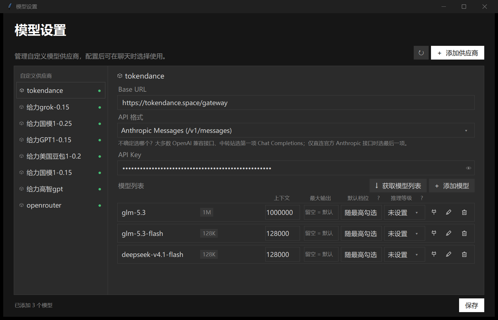

# ZCode 获取模型列表

给 [ZCode](https://github.com/zai-org/ZCode)（智谱）桌面端补一个官方没有的能力：在「模型设置」里按 **Base URL + API Key 自动拉取模型列表**，不用再手填模型 ID。

## 为什么做这个

ZCode 官方的自定义供应商页面添加模型只能手动输入 ID、手填参数，自动拉取的需求被官方关闭（feedback #226 / #648）。这个工具做成 ZCode 同款深色 UI 的单窗口选单：拉取、勾选、保存一步到位，关窗即退出、不常驻后台。

## 功能

- 填 Base URL + API Key，一键拉取 `/models` 候选（兼容 `/models` 与 `/v1/models`，支持 Chat Completions / Responses / Anthropic Messages 三种格式）
- 行内编辑：上下文窗口、最大输出（留空=默认）、**推理等级勾选**（可跳档，支持 ultra）、默认档位
- **参数自动补全**：已保存配置比对 → 内置模型库 → 服务商目录元数据，已填的值一律不动（详见下节）
- 每行「测试」：用该模型真实发一次最小请求，回报成功/失败 + 耗时 + 中文原因（401 / 超时 / 网络不通）
- 保存写入 `%USERPROFILE%\.zcode\v2\provider_config.json`，写前自动毫秒级备份，未改动的推理等级原样保留
- UI 对齐 ZCode 官方「模型设置」页（色板、字体层级、chips、弹层按 app.asar 实测还原）

## 内置模型库与自动补全

- 获取模型列表后，行内空缺的 上下文 / 最大输出 / 推理等级 会按下面的优先级自动补全（已填的值一律不动）：
  1. 跨供应商按 id 比对你已有的配置
  2. 内置模型库（`builtin_model_rules.json`）= ZCode 内置 modelMatch 规则（优先读安装目录的活文件）+ OpenRouter 实测参数快照（2026-09-27，213 个家族）
  3. 服务商目录元数据（/models 返回的 context_length 等）
  4. 都没有 → 上下文 128000，最大输出留空（用模型默认）
- 手动输入模型 ID（回车 / 焦点离开）走同一条链。
- 刷新内置库：`python tools/refresh_builtin_models.py`（直连 OpenRouter，失败自动走 127.0.0.1:7890 代理）。

## 使用

- 双击本目录的 `获取模型列表.bat`，或 `pythonw app.py`
- 改完点窗口里的「保存」，再回 ZCode 设置页刷新
- 或直接下载 [最新 Release](https://github.com/Lyn-Linyanhe/zcode-provider-sync/releases/latest)：Python 3.10+（仅标准库，无第三方依赖），Windows 10/11

## English

A single-window companion for the ZCode desktop app: fetch available models from your provider by Base URL + API Key (the official settings page lacks this), edit context window / max output / reasoning levels inline, auto-fill parameters from a built-in model database, test each model with a real minimal request, and write everything into `~/.zcode/v2/provider_config.json`. Pure-stdlib Python 3.10+, dark UI matching ZCode's own settings page, closes completely on exit.

## 参与开发

欢迎 PR 与 issue：上手方式、代码结构和验收规矩见 [CONTRIBUTING.md](CONTRIBUTING.md)，适合上手的任务看 [`good first issue`](https://github.com/Lyn-Linyanhe/zcode-provider-sync/issues?q=is%3Aissue+is%3Aopen+label%3A%22good+first+issue%22) 标签。

## License

[MIT](LICENSE)
